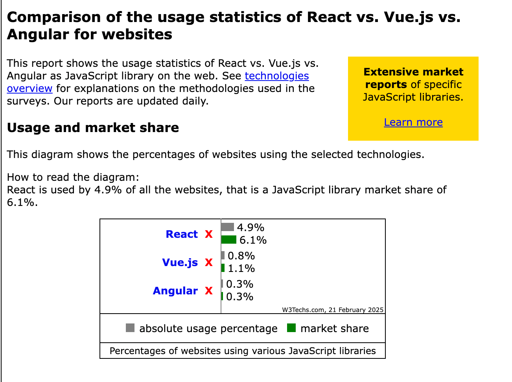

###  三大前端框架市场占比


###  React基础知识
#### 组件通信方式
一类是类（ Class ）组件，另一类是函数（ Function ）组件。官方文档已经把 class 组件划到了 [legacy（遗产）](https://react.dev/reference/react/legacy)的目录下

1. 父传子，子传父
2. context

- 在 React 中，Context 主要用于在组件树中跨层级传递数据，特别适用于祖先组件向深层嵌套的后代组件传递状态或方法。有些人可能认为在日常开发中 Context 用得不多，但实际上，它是 React 生态中非常重要的机制。Vue 的 provide 和 inject 也正是借鉴了 Context 的思想。

- Context 采用的模式如下：

 创建 Context：使用 React.createContext() 定义一个上下文对象。
1. Provider（提供者）：在外层组件中使用 Provider 组件，向其子组件传递数据。
2. Consumer（消费者）：在需要使用数据的内部组件中，通过 Consumer 组件或 useContext Hook 获取数据。
这种模式使得在多层组件嵌套的情况下，避免了繁琐的 props 逐层传递，提高了代码的可读性和维护性。


#### React V16的10种React Hooks介绍
[文档](https://zh-hans.react.dev/reference/react/hooks)

1. useState
2. useEffect
3. useContext
4. useReducer
5. useMemo
6. useCallback
7. useRef
8. useImperativeHandle 结合forwardRef
9. useLayoutEffect
10. useDebugValue

#### React V18的5种React Hooks介绍
1. useSyncExternalStore
2. useTransition
3. useDeferredValue
4. useInsertionEffect
5. useId

hooks的闭包陷阱
#### 自定义Hooks
```

```